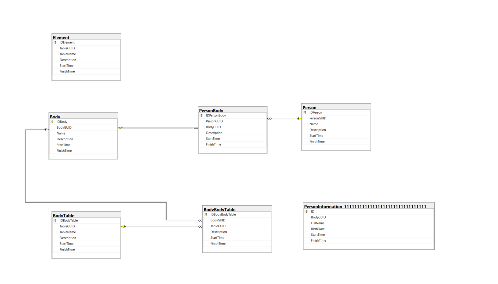

# NOMIS – ASP.NET Core MVC (Exemplo Didático)

Este repositório contém uma **aplicação ASP.NET Core MVC (.NET 8)** que implementa
uma **versão mínima do kernel da base de dados do NOMIS Middleware**.

O objetivo do projeto **não é** fornecer uma implementação completa do NOMIS,
mas sim **tornar explícita e compreensível** a estrutura da base de dados,
os conceitos de **Body**, **GUID**, e **temporalidade**, conforme descrito no NOMIS.

---

## Objetivo do Projeto

Este projeto tem como objetivos principais:

- Compreender a separação entre:
  - **Identidade lógica (GUID)**  
  - **Implementação técnica (ID inteiro)**
- Demonstrar o papel do **Body** como abstração de informação
- Ilustrar a **temporalidade dos dados** (StartTime / FinishTime)
- Mostrar como uma tabela de informação concreta (ex.: PersonInformation)
  se integra no kernel NOMIS
- Disponibilizar uma **visualização clara das relações** entre entidades

Trata-se de um **exemplo académico e exploratório**.

---

## Tecnologias Utilizadas

- ASP.NET Core MVC 8
- Entity Framework Core 8
- SQL Server (LocalDB)
- Bootstrap 5 (UI)
- C#

---

## Estrutura Geral da Base de Dados (Kernel NOMIS Simplificado)

A aplicação implementa um subconjunto do **NOMIS Middleware Database Kernel**,
com as seguintes tabelas:

### Tabelas do Kernel

- **Element**  
  Regista as tabelas geridas pelo middleware (metadados).

- **BodyTable**  
  Identifica tabelas físicas que armazenam informação (Bodies).

- **Body**  
  Identifica um elemento de informação de forma abstrata.

- **BodyBodyTable**  
  Relaciona um Body com a tabela física onde o seu conteúdo reside.

- **Person**  
  Identifica uma pessoa.

- **PersonBody**  
  Relaciona uma pessoa com um Body (informação associada).

### Tabela de Conteúdo (Exemplo)

- **PersonInformation_<GUID>**  
  Exemplo de tabela concreta que armazena informação de pessoas.
  O nome físico da tabela inclui um GUID para garantir identidade e flexibilidade.

---

## Esquema da Base de Dados

A figura seguinte apresenta o **esquema da base de dados** utilizado neste exemplo,
incluindo as tabelas do kernel e a tabela `PersonInformation_<GUID>`.

> Nota: As relações são estabelecidas logicamente através de GUIDs,
> mesmo quando não existem *foreign keys* físicas explícitas.



---

## Visão Lógica Simplificada

De forma simplificada, a navegação entre entidades segue o padrão:

```text
Person
  └── PersonBody
        └── Body
              └── BodyBodyTable
                    └── BodyTable
                          └── PersonInformation_<GUID>
```

- **Person** – identifica o ator humano
- **PersonBody** – associa uma pessoa a um Body
- **Body** – identifica um conjunto de informação de forma abstrata
- **BodyBodyTable** – indica em que tabela física o conteúdo do Body está armazenado
- **BodyTable** – identifica a tabela física de armazenamento
- **PersonInformation_<GUID>** – contém os dados reais da pessoa

---

## Temporalidade dos Dados

Todas as entidades principais seguem o modelo temporal inspirado no STDB:

- **StartTime** – início da validade do registo
- **FinishTime** – fim da validade do registo
- Um registo com `FinishTime = NULL` é considerado **atual**
- Os registos **nunca são apagados**

### Exemplo

| FullName        | StartTime | FinishTime |
| --------------- | --------- | ---------- |
| Ana Silva       | 2021-01   | 2023-06    |
| Ana Maria Silva | 2023-06   | NULL       |

---

## Seed de Dados

No arranque da aplicação é executado um **seed inicial** que cria:

- 2 pessoas
- 1 tabela `PersonInformation_<GUID>` fixa (para fins didáticos)
- Informação associada a ambas as pessoas
- Histórico temporal para uma das pessoas (dois registos)

---

## Visualização na Aplicação

A aplicação disponibiliza uma view para explorar a estrutura NOMIS:

```
/NomisExplorer
```

Esta página permite visualizar:

- Pessoas existentes
- Bodies associados a cada pessoa
- A tabela física onde cada Body está armazenado
- Registos atuais e históricos da PersonInformation

---

## Contexto Académico

Este projeto foi desenvolvido com fins **académicos e exploratórios**, para apoiar
a compreensão prática dos conceitos do NOMIS Middleware Database.

---

## Licença

Projeto académico / experimental.

